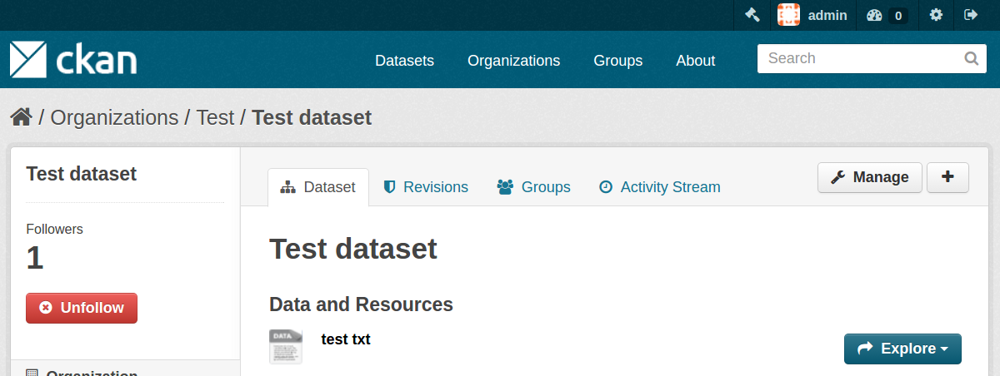

====================
ckanext-uploadbutton
====================

------------
Installation
------------

.. Add any additional install steps to the list below.
   For example installing any non-Python dependencies or adding any required
   config settings.

To install ckanext-uploadbutton:

1. Activate your CKAN virtual environment, for example::

     . /usr/lib/ckan/default/bin/activate

2. Install the ckanext-uploadbutton Python package into your virtual environment::

     pip install ckanext-uploadbutton

3. Add ``uploadbutton`` to the ``ckan.plugins`` setting in your CKAN
   config file (by default the config file is located at
   ``/etc/ckan/default/production.ini``).

4. Restart CKAN. For example if you've deployed CKAN with Apache on Ubuntu::

     sudo service apache2 reload

------------------------
Development Installation
------------------------

To install ckanext-uploadbutton for development, activate your CKAN virtualenv and
do::

    cd ckanext-uploadbutton
    python setup.py develop
    pip install -r dev-requirements.txt

-----------------
Running the Tests
-----------------

To run the tests, do::

    nosetests --nologcapture --with-pylons=test.ini

To run the tests and produce a coverage report, first make sure you have
coverage installed in your virtualenv (``pip install coverage``) then run::

    nosetests --nologcapture --with-pylons=test.ini --with-coverage --cover-package=ckanext.uploadbutton --cover-inclusive --cover-erase --cover-tests
